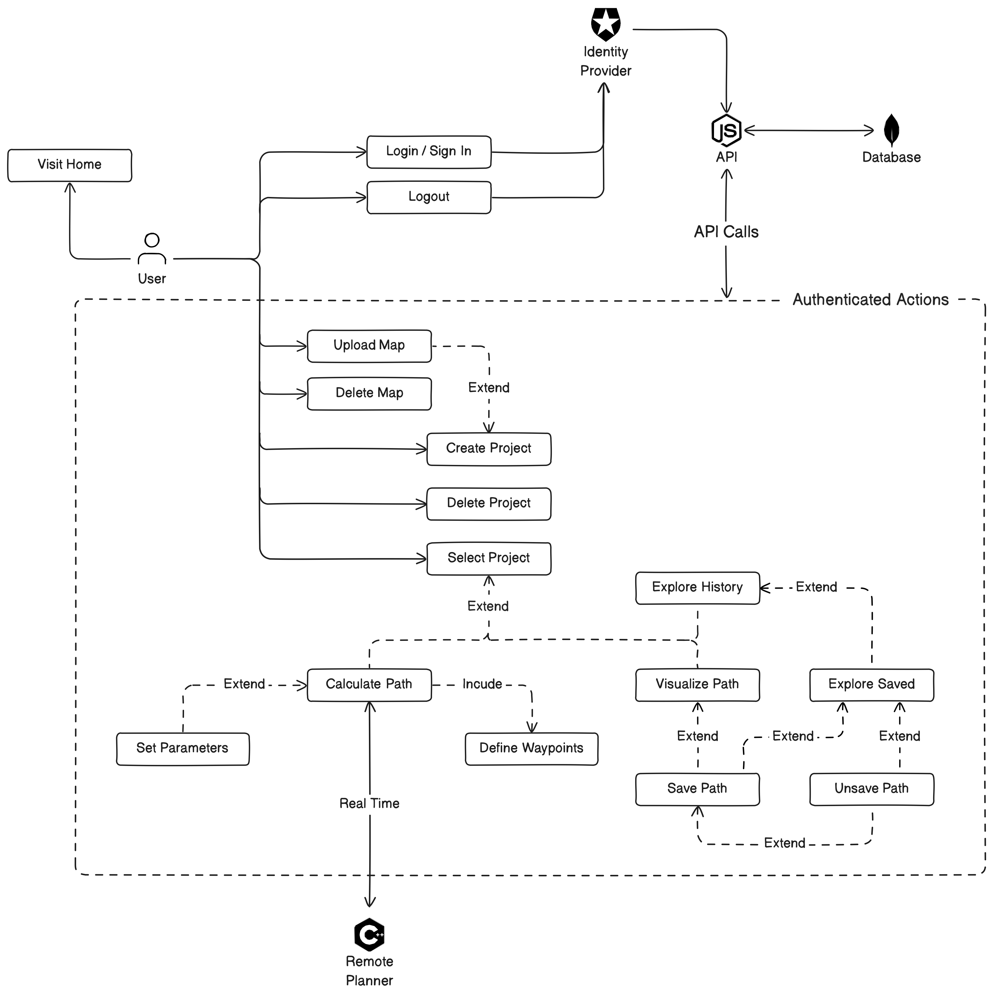

# Octomap Path Planning Interface

Una webapp che permette di pianificare e visualizzare percorsi in ambienti 3D sfruttando le
potenzialità della libreria [THREE.js](https://threejs.org/) e l'efficienza di [Octomap](http://octomap.github.io/).

## Installazione e avvio
Abbiamo munito il progetto di un [docker-compose.yml](docker-compose.yml) per facilitare l'installazione.
Per eseguire il progetto è necessario avere Docker installato sul proprio sistema.
Per installare Docker, seguire le istruzioni presenti sul sito ufficiale: [Docker](https://docs.docker.com/get-docker/).

Il progetto è stato pensato ed è pronto per il deployment su un server remoto, ma per mancanza di servizi di hosting
gratuiti con performance sufficienti ad eseguire il progetto, è stato deciso di eseguirlo in locale.

Per eseguire il progetto, eseguire i seguenti comandi:
```bash
git clone https://github.com/antopio26/oppi.git
cd oppi
docker-compose up
```

Il progetto sarà disponibile all'indirizzo [http://localhost](http://localhost), con un websocket server in ascolto sulla porta `9002` (*ws://localhost:9002*).

## Utilizzo (Casi d'Uso UML)




All'avvio dell'applicazione, verrà visualizzata la schermata principale `/home`, che contiene le informazioni generali del progetto.

Da qui sarà possibile navigare verso le altre schermate passando per la pagina di login gestita da [Auth0](https://auth0.com/), che si occupa di gestire l'autenticazione e le autorizzazioni degli utenti.

Effettuato il login, l'utente verrà reindirizzato alla pagina `/dashboard`, dove potrà visualizzare la lista delle mappe e dei progetti, e potrà crearne di nuovi.
Ogni progetto è associato a un utente, a una mappa, e contiene alcuni parametri fondamentali per la pianificazione del percorso.

Una volta selezionato un progetto, verrà mostrata all'utente la pagine `/map`, dove potrà visualizzare la mappa 3D servita dal server websocket, e potrà iniziare a inserire i waypoints per la determinazione del percorso.
In questa pagina si potrà gestire attivamente tutta la parte relativa alla generazione dei percorsi impostando i parametri, e rilevando le metriche di performance.

Spostandosi nella pagina `/path`, l'utente potrà visualizzare lo storico dei percorsi prodotti dal progetto attivo, e potrà scegliere di rappresentarli nuovamente all'interno della mappa.
È stata aggiunta la possibilità di impostare un segnalibro per i percorsi più interessanti, in modo da poterli visualizzare più facilmente in futuro.

## Architettura

Segue una breve descrizione dell'architettura dell'applicazione.

### Diagramma


Questa struttura rende OPPI facile da manutenere, con componenti ben separati che facilitano l'aggiornamento e il deployment.

### Frontend
- **Tecnologia:** React
- **Ruolo:** Fornisce l'interfaccia utente per interagire con l'applicazione, si occupa della comunicazione con il server websocket, mostra dati e gestisce le interazioni.

### Backend
- **Tecnologia:** Node.js (Express)
- **Ruolo:** Serve il frontend, gestisce le sue richieste alle API, e interagisce con MongoDB per il salvataggio dei dati nel database.

### MongoDB Atlas
- **Tecnologia:** MongoDB
- **Ruolo:** Ospitato su Atlas, gestisce i dati dell'applicazione, come mappe, progetti e percorsi.

### Pianificatore Remoto
- **Tecnologia:** C++
- **Ruolo:** Comunica in tempo reale con React tramite WebSocket e pianifica i percorsi sulla base delle informazioni ricevute, infine restituisce nuovamente i risultati al frontend.

### Docker Compose

L'applicazione usa Docker per separare i vari servizi.

#### Backend Container
- **Contenuto:** Backend (Node.js)
- **Ruolo:** Compila il backend, serve i file, gestisce le richieste API e comunica con MongoDB.

#### Remote Planner Container
- **Contenuto:** Pianificatore Remoto
- **Ruolo:** Esegue il servizio di pianificazione dei percorsi e comunica tramite la porta `9002`.

#### Shared Volume
- **Contenuto:** File delle Mappe
- **Ruolo:** Volume condiviso tra il backend e il pianificatore remoto per memorizzare e accedere ai file delle mappe (che il Remote Planner elabora e invia al frontend).

## Modello dei Dati

Il modello dei dati è strutturato in diverse collezioni per ottimizzare l'uso e la gestione dei dati.
Questa divisione consente aggiornamenti efficienti e accessi rapidi a specifiche sezioni del database
senza sovraccaricare le richieste.

### Project
Rappresenta i progetti creati dagli utenti. Ogni progetto contiene informazioni di base come il nome, 
l'utente proprietario, e metriche varie come il numero di percorsi e nodi. È collegato a una mappa specifica
e può avere parametri aggiuntivi. Questa separazione facilita l'aggiornamento dei progetti senza influire
sui percorsi associati, che sono memorizzati separatamente.

### Map
Le mappe rappresentano gli ambienti in cui i percorsi vengono pianificati. Ogni mappa include un nome, l'utente proprietario, la data di creazione, le dimensioni e un offset. Poiché più progetti possono utilizzare la stessa mappa, le mappe sono mantenute in una collezione separata. Questo approccio evita duplicazioni e consente l'uso condiviso delle mappe tra diversi progetti.

### Parameters
Contiene parametri specifici utilizzati negli algoritmi di pianificazione. Questi includono valori come la soglia, la lunghezza del passo, e altre configurazioni che influenzano il comportamento dell'algoritmo. La loro separazione permette una gestione più modulare e la possibilità di riutilizzare gli stessi parametri in più progetti.

### Path
I percorsi generati dagli algoritmi di pianificazione sono memorizzati in questa collezione. Ogni percorso è associato a un progetto specifico e contiene dettagli come i waypoints, i colori dei waypoints, e un percorso liscio. Poiché i percorsi possono essere frequentemente aggiornati, mantenerli in una collezione separata riduce l'impatto sugli aggiornamenti del progetto e consente una gestione più efficiente dei dati.

### User
Gli utenti che utilizzano l'applicazione sono rappresentati in questa collezione. Include dettagli di autenticazione e informazioni personali come nome, cognome, e preferenze di tema. Questo permette una gestione centralizzata degli utenti e facilita il collegamento con i progetti e le mappe che creano.

## Diagramma delle Classi
Il diagramma delle classi fornisce una visualizzazione dettagliata delle proprietà di ogni entità e delle relazioni tra di esse. Questo approccio strutturato garantisce una chiara comprensione del modello dei dati e supporta una gestione efficace del database.


## API

L'applicazione espone un'API RESTful per la gestione dei dati. Questo approccio consente una comunicazione efficiente tra il frontend e il backend, facilitando l'accesso e la modifica dei dati.

### Utenti (`/api/user`)
Gestisce le informazioni dell'utente autenticato. La creazione di nuovi utenti viene gestita internamente in quanto i dati vengono forniti da Auth0, e l'utente viene creato automaticamente al primo accesso.
#### Endpoint
- **GET `/api/user/`**: Recupera le informazioni dell'utente autenticato.
- **PUT `/api/user/`**: Modifica il nickname dell'utente autenticato.

### Mappe (`/api/maps`)
Gestisce le mappe dell'applicazione.
#### Endpoint
- **GET `/api/maps/`**: Recupera tutte le mappe.
- **POST `/api/maps/`**: Crea una nuova mappa.
- **GET `/api/maps/:id`**: Recupera una mappa specifica tramite ID.
- **PUT `/api/maps/:id`**: Aggiorna una mappa specifica tramite ID.
- **DELETE `/api/maps/:id`**: Elimina una mappa specifica tramite ID.

### Progetti (`/api/projects`)
Gestisce i progetti dell'utente autenticato. Questa rotta raccoglie sotto di se anche i parametri e i percorsi associati ai singoli progetti.
#### Endpoint
- **GET `/api/projects/`**: Recupera tutti i progetti dell'utente autenticato.
- **POST `/api/projects/`**: Crea un nuovo progetto per l'utente autenticato.
- **GET `/api/projects/:id`**: Recupera un progetto specifico tramite ID.
- **DELETE `/api/projects/:id`**: Elimina un progetto specifico tramite ID.
- **PUT `/api/projects/:id`**: Aggiorna un progetto specifico tramite ID.
- **PUT `/api/projects/:id/lastOpenAt`**: Aggiorna la data dell'ultima apertura di un progetto.
- **PUT `/api/projects/:id/parameters`**: Aggiorna i parametri di un progetto.
- **Middleware**:
    - **`/:id/paths`**: Passa il progetto al router dei percorsi.

### Percorsi (`/api/projects/:projectId/paths`)
Gestisce i percorsi associati a un progetto specifico.
#### Endpoint
- **GET `/api/projects/:projectId/paths`**: Recupera tutti i percorsi di un progetto specifico.
- **POST `//api/projects/:projectId/paths`**: Crea un nuovo percorso per un progetto specifico.
- **GET `/api/projects/:projectId/paths/saved`**: Recupera tutti i percorsi salvati di un progetto specifico.
- **GET `/api/projects/:projectId/paths/:id`**: Recupera un percorso specifico tramite ID.
- **PUT `/api/projects/:projectId/paths/:id`**: Aggiorna un percorso specifico tramite ID.
- **PUT `/api/projects/:projectId/paths/:id/save`**: Segna un percorso come salvato.
- **PUT `/api/projects/:projectId/paths/:id/unsave`**: Rimuove il segno di salvato da un percorso.
- **DELETE `/api/projects/:projectId/paths/:id`**: Elimina un percorso specifico tramite ID.

## Funzionalità RealTime

Il modulo di gestione delle funzionalità real-time è una componente cruciale del sistema di pianificazione
dei percorsi basato su Octomap. Questa sezione descrive il funzionamento del contesto RemotePlannerContext, implementato
in React e offerto attraverso l'hook useRemotePlanner, che gestisce la comunicazione in tempo reale con il pianificatore
remoto tramite WebSocket.

### Gestione della Connessione WebSocket

L'inizializzazione della connessione WebSocket è gestita dalla libreria `useWebSocket`, che facilita l'interazione con
il server remoto. Quando la connessione è stabilita, il tipo di dati binari viene configurato per accettare `arraybuffer`,
necessario per gestire i dati binari provenienti dal server. Non sono state utilizzate librerie come *Socket.IO* in quanto
avrebbero aggiunto overhead e complessità non necessaria da un punto di vista implementativo. La priorità in questo caso è
stata data alla rapidità di invio e alla leggerezza fornita dalla libreria WebSocket pura.

### Stato dell'Applicazione

Il contesto RemotePlannerContext mantiene e aggiorna vari stati cruciali per la gestione della pianificazione dei percorsi:

- **Waypoints**: Una lista di waypoint che definiscono i punti di interesse lungo il percorso.
- **Voxels**: Dati voxel che rappresentano la mappa 3D ricevuta dal server.
- **RRT Paths**: Percorsi generati tramite l'algoritmo Rapidly-exploring Random Tree.
- **Optimized Paths**: Percorsi ottimizzati per efficienza e sicurezza.
- **Smooth Path**: Percorso liscio che riduce le asperità del percorso ottimizzato.
- **Chrono Path**: Tracciamento cronologico dei percorsi generati.

### Invio dei Parametri e Comandi

Il sistema fornisce funzioni per inviare dati e comandi al pianificatore remoto. La funzione `sendParameters` consente l'invio dei parametri di configurazione, mentre `changeMap` permette di aggiornare la mappa corrente. La funzione `resetPlanner` reimposta tutti gli stati, consentendo un nuovo ciclo di pianificazione senza residui dai precedenti.

### Ricezione e Gestione dei Messaggi

La gestione dei messaggi ricevuti dal server è centralizzata nella funzione `onMessage`, che decodifica e smista i dati in base al tipo di messaggio ricevuto:

- **octomap_path**: Aggiorna i percorsi RRT con nuovi dati ricevuti, filtrando i percorsi duplicati.
- **octomap_optimized_path**: Aggiorna i percorsi ottimizzati.
- **octomap_smoothed_path**: Imposta il percorso liscio.
- **octomap(resolution)**: Decodifica e aggiorna i dati voxel della mappa.

### Aggiornamento Dinamico dei Waypoints

Un effetto collaterale (`useEffect`) è configurato per inviare automaticamente i waypoints al pianificatore remoto
non appena la connessione WebSocket è aperta e ci sono almeno due waypoints definiti. Questo garantisce che la
pianificazione del percorso possa iniziare immediatamente dopo l'aggiunta dei waypoints.

### Integrazione e Condivisione dello Stato

Il RemotePlannerContext è inserito nel provider del contesto a livello dell'applicazione, rendendo disponibili i dati e
le funzioni a tutti i componenti figli, facilitando così una gestione centralizzata e coerente delle funzionalità real-time.

Questa architettura garantisce che tutte le operazioni di pianificazione dei percorsi possano essere eseguite in tempo reale,
con aggiornamenti immediati e una comunicazione bidirezionale efficiente tra il frontend e il pianificatore remoto,
migliorando notevolmente l'interattività e l'efficacia del sistema di pianificazione dei percorsi.

## Componenti React

Albero dei componenti React
```markdown
- root
  - Auth0Provider
    - App
      - AppContextProvider
        - RemotePlannerContextProvider
          - FetchingLayer
            - Routes
              - Home
                - Canvas
                  - MapScene
                    | - Octomap
                    | - Nodes
                    | - Path
              - Paths
                - Sidebar
                  | - PathsSidebar
                - PathCard
              - Dashboard
                - Sidebar
                  - DashboardSidebar
                    | - MapsList
                - ProjectList
              - Map
                - MapContextProvider
                  - Sidebar
                    - MapSidebar
                      | - NodeList
                      | - ParametersList
                  - Canvas
                    - MapScene
                      | - Octomap
                      | - Nodes
                      | - Path
                  - Metrics
```

Partendo dall'elemento radice, abbiamo il `root` che contiene il componente `Auth0Provider` per la gestione dell'autenticazione.
All'interno è presente il componente `App` che rappresenta l'applicazione principale e ha così la possibilità di accedere al contesto di Auth0 e di poter controllare lo stato di autenticazione dell'utente.
Di seguito troviamo i due provider dei contesti `AppContextProvider` e `RemotePlannerContextProvider` che permettono di condividere lo stato dell'applicazione tra i vari componenti figli.
Nell' `AppContextProvider` vengono condivisi gli stati che consentono di ridurre i caricamenti tra le pagine.
Nel `RemotePlannerContextProvider` viene gestita la connessione con il Remote Planner e la condivisione di tutti gli stati necessari per la comunicazione real-time.
Al loro interno  componente `FetchingLayer` che si occupa esclusivamente di caricare i dati al caricamento dell'applicazione, prima di renderizzare la pagina scelta, permettendo di anticipare i caricamenti e di evitare di visualizzare pagine incomplete a ogni cambio di pagina.
Dopodicché troviamo le `Routes` che si occupa di gestire il routing interno dell'applicazione, e di renderizzare la pagina corretta in base all'URL.
Le pagine principali sono `Home`, `Paths`, `Dashboard` e `Map`, ognuna con i propri componenti figli.

Come detto precedentemente, la pagina `Home` contiene le informazioni generali dell'applicazione, in più include un componente `Canvas` che mostra un'anteprima di quella che sarà la pianificazione del percorso in una mappa.

La pagina `Paths` mostra lo storico (al massimo 100) dei percorsi generati sul progetto attivo, consente di filtrarli per i salvati e di visualizzarli nuovamente nella mappa selezionando una `PathCard`.

La pagina `Dashboard` mostra la lista dei progetti e delle mappe (`ProjectList` e `MapsList`), permette di crearne di nuovi e di selezionarli per aprirli nella mappa.

La pagina `Map` mostra la mappa 3D del progetto attivo, permette di inserire i waypoints e di impostare i parametri per la pianificazione del percorso.
I componenti al suo interno condividono alcuni stati del `MapContextProvider` e altri dai contesti superiori.
Nella `MapSidebar` si possono gestire waypoints e parametri attraverso gli appositi componenti `NodeList` e `ParametersList`.
Il componente principale della pagina e dell'applicazione è il `Canvas` che contiene la `MapScene` con la mappa 3D, `Nodes` e `Path` che vengono aggiornati in tempo reale con i dati ricevuti dal Remote Planner.
Infine sarà visibile un floating panel, `Metrics`, con le metriche di performance del percorso.


